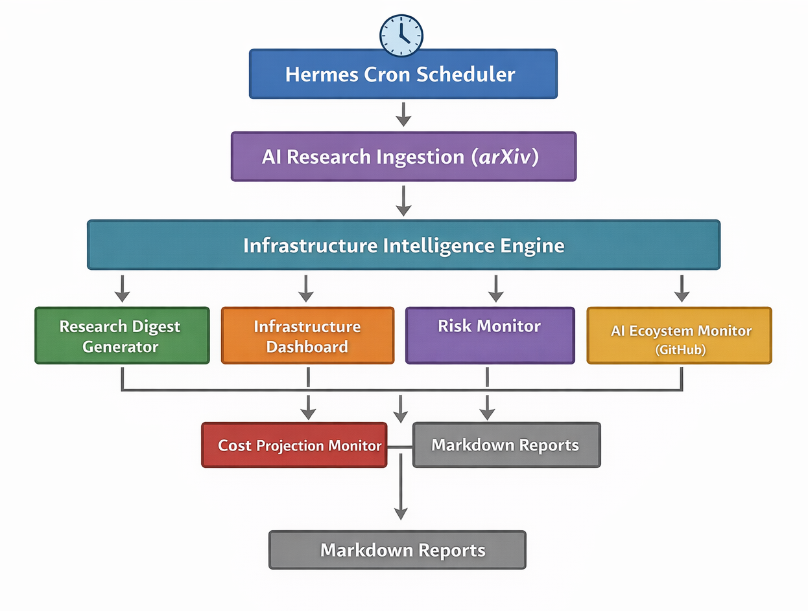

# 🧠 Hermes AI Infrastructure Monitoring Toolkit


> Autonomous AI infrastructure monitoring with Hermes Agent.  
> Periodically analyzes AI research and infrastructure costs using scheduled agent workflows.  
> Designed as a minimal reference for building safe long-running autonomous systems.

---

A minimal, production-oriented reference implementation of autonomous AI infrastructure monitoring using Hermes Agent.

This toolkit demonstrates:

- Automated research ingestion (arXiv API)
- AI infrastructure relevance analysis
- Usage projection modeling
- Headless cron-based orchestration
- System-level gateway integration

This repository includes reproducible cron configurations and example report outputs.



---

## ⚡ Quick Start

Install Hermes and launch the system.

```bash
pip install hermes-agent
hermes login
```

Create a workspace:

```bash
mkdir hermes-ai-monitor
cd hermes-ai-monitor
mkdir reports
```

Start Hermes:

```bash
hermes chat
```

Then create the cron jobs described in the full deployment guide.

➡ See [`guide.md`](./guide.md)

---

## 🏗 Architecture

```text
Hermes Cron Scheduler
        ↓
External API Ingestion
        ↓
Structured AI Analysis
        ↓
Local Markdown Reports
```

---

## 🔬 Components

### 1️⃣ AI Research Digest
Runs every 6 hours.

- Fetches latest AI papers from arXiv
- Selects infrastructure-relevant papers
- Generates structured digest reports
- Saves to `/reports/`

### 2️⃣ Usage Projection Monitor
Runs every 12 hours.

- Estimates monthly execution volume
- Projects token consumption
- Calculates estimated cost
- Generates structured cost report

---

## 📦 Folder Structure

```text
hermes-ai-infrastructure-monitoring-toolkit/
│
├── README.md
├── setup.md
├── architecture.md
├── cron-config.md
├── example_research_digest.md
├── example_cost_projection.md
├── reports/
```

---

## 📄 Example Output

Sample generated artifacts:

- [`example_research_digest.md`](./example_research_digest.md)
- [`example_cost_projection.md`](./example_cost_projection.md)

Runtime outputs are written to the `/reports/` directory and are not version-controlled.

---

## 🚀 Setup

See `setup.md` for full installation guide.

---

## ⚠ Cron Configuration Notes

Production intervals are intentionally conservative:

- **Research Digest** → every 6 hours (360m)
- **Cost Projection Monitor** → every 12 hours (720m)

Avoid short intervals (e.g., 5m) in autonomous mode.  
High-frequency schedules can rapidly increase token consumption.

For testing:
- Create a temporary job
- Run `hermes cron tick`
- Remove the job immediately

This ensures predictable cost and stable long-term operation.

## 📖 Full Deployment Guide

For a detailed step-by-step guide see:

[guide.md](./guide.md)

---

## 🎯 Purpose

This repository serves as a minimal, reproducible example of Hermes-based AI infrastructure automation.

It is not affiliated with or endorsed by Nous Research.
